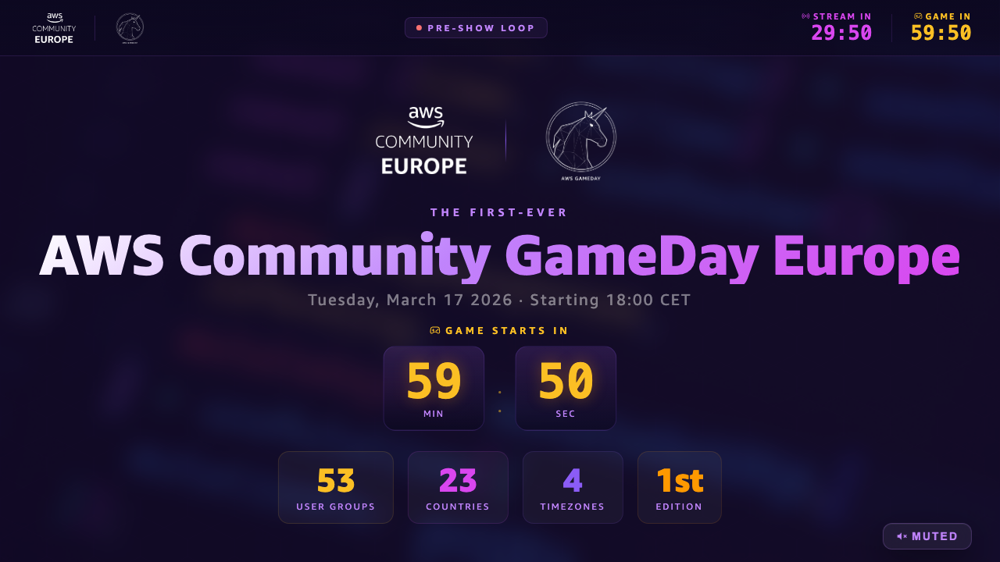
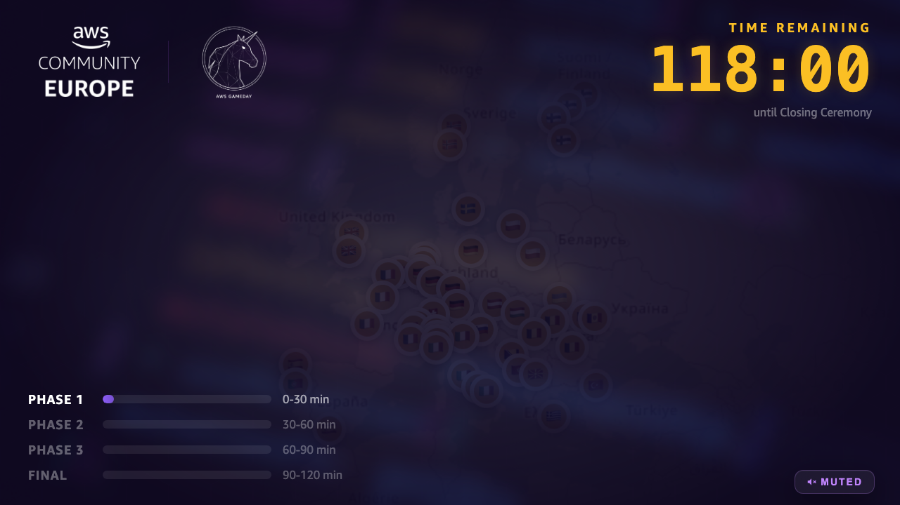

# Screenshots — Compositions

Screenshots of the main event stream compositions, rendered from the live Remotion code. These show exactly what participants and organizers saw on screen during AWS Community GameDay Europe 2026.

All images were rendered with `npx remotion still` at frames that represent the visual peak of each scene — not frame 0 (which is often a fade-in).

---

## Event sequence in order

### Pre-Show: Info Loop (`00-InfoLoop`)

The 30-minute rotating info loop that runs at every participating user group location before the stream goes live. Cycles through: welcome countdown, schedule, user group map, organizer introductions, AWS community programs, speaker bio, event checklist.



**When shown:** 17:30–18:00 CET at local UG venues
**Duration:** 30 min (loops continuously)
**File:** `src/compositions/00-preshow/InfoLoop.tsx`

---

### Pre-Show: Countdown (`00-Countdown`)

Simple countdown timer used in the early window before the info loop starts — just numbers, no content. Clean and minimal so it works at venues that haven't set up audio yet.


**When shown:** Optional, before the Info Loop
**Duration:** 10 min (loopable)
**File:** `src/compositions/00-preshow/Countdown.tsx`

---

### Main Event (`01-MainEvent`)

The 30-minute live event composition. Shows speaker names and roles as they talk, community intro slides, schedule, a support process video section, GameDay instructions, and the code distribution phase. Linda hosts from Vienna; Jerome & Anda represent the community; Arnaud & Loïc (AWS Gamemasters) explain the game rules.


**When shown:** 18:00–18:30 CET (stream live, audio on)
**Duration:** 30 min
**File:** `src/compositions/01-main-event/MainEvent.tsx`

---

### Gameplay Overlay (`02-Gameplay`)

Muted background overlay displayed while the 53+ user groups compete. Subtle branding with the event logo — keeps the stream visually alive without distracting teams from the actual game.



**When shown:** 18:30–20:30 CET (stream muted, game running)
**Duration:** 120 min
**File:** `src/compositions/02-gameplay/Gameplay.tsx`

---

### Closing Part A — Pre-Rendered (`03A-ClosingPreRendered`)

The first closing composition, rendered before the event. Plays as soon as gameplay ends. Shows a hero intro with all 53+ user group logos scrolling by, transitions into a fast scroll and shuffle countdown that builds suspense before the winner reveal.


**When shown:** ~20:30 CET immediately after game ends
**Duration:** ~2.5 min
**File:** `src/compositions/03-closing/ClosingPreRendered.tsx`
**Note:** Must be rendered to video before the event. Uses no live data.

---

### Closing Part B — Winners Template (`03B-ClosingWinnersTemplate`)

The live winners reveal. Bar chart animating team scores 6th → 1st, individual podium cards, and a thank-you screen. This composition requires real final scores to be entered before rendering — see [TEMPLATE.md](../../TEMPLATE.md).


**When shown:** ~20:33 CET after Part A finishes
**Duration:** ~5 min
**File:** `src/compositions/03-closing/ClosingWinnersTemplate.tsx`
**Note:** Update `src/utils/closing.ts` with real scores, then render.

---

### Marketing Video (`Marketing-OrganizersVideo`)

A 15-second social media clip for organizers to share after the event — shows the AWS Community + GameDay branding, organizer faces, and location info. Not shown during the live stream.


**When used:** Post-event social media
**Duration:** 15 sec
**File:** `src/compositions/marketing/MarketingVideo.tsx`

---

## Older reference frames

These are earlier renders kept for historical comparison. The ones above are the current canonical screenshots.

| File | What it shows |
|------|---------------|
| `readme-preshow-frame-150.png` | Pre-show (earlier version of info loop) |
| `readme-preshow-frame-0.png` | Pre-show at frame 0 |
| `readme-mainevent-frame-900.png` | Main event — 30s mark |
| `readme-gameplay-frame-3600.png` | Gameplay — 2-minute mark |
| `readme-closing-shuffle-frame-2000.png` | Closing Part A shuffle phase |
| `readme-winners-reveal-frame-3500.png` | Closing Part B — bar chart mid-reveal |
| `readme-winners-1st-place-frame-5800.png` | Closing Part B — 1st place reveal moment |
| `readme-winners-podium-frame-7258.png` | Closing Part B — full podium |
| `readme-winners-thankyou-frame-8200.png` | Closing Part B — thank you screen |

---

## Regenerating

```bash
npx remotion still src/index.ts 00-InfoLoop screenshots/compositions/readme-infoloop.png --frame=300
npx remotion still src/index.ts 00-Countdown screenshots/compositions/readme-countdown.png --frame=150
npx remotion still src/index.ts 01-MainEvent screenshots/compositions/readme-mainevent.png --frame=900
npx remotion still src/index.ts 02-Gameplay screenshots/compositions/readme-gameplay.png --frame=3600
npx remotion still src/index.ts 03A-ClosingPreRendered screenshots/compositions/readme-closing-prerendered.png --frame=1800
npx remotion still src/index.ts 03B-ClosingWinnersTemplate screenshots/compositions/readme-closing-winners.png --frame=3500
npx remotion still src/index.ts Marketing-OrganizersVideo screenshots/compositions/readme-marketing.png --frame=90
```
