# Screenshots — Inserts

Screenshots of all 29 live insert compositions at frame 60–120 (after entry animations settle). These are the full-screen 30-second announcements triggered by the stream operator during gameplay.

Inserts were not part of the original GameDay Europe 2026 stream. They were designed based on participant feedback requesting more location-aware, live commentary moments. They are included here as a ready-to-use library for future editions.

See [docs/playbook.md](../../docs/playbook.md) for the stream operator guide — when to trigger each insert and how to prepare Props values before the event.

---

## Event Flow

Phase markers for the major event transitions. These are the rhythm of the broadcast.

| Screenshot | Insert ID | Purpose | Props to update |
|------------|-----------|---------|-----------------|
|  | `Insert-QuestsLive` | Kickoff — quests are now accessible | none |
| 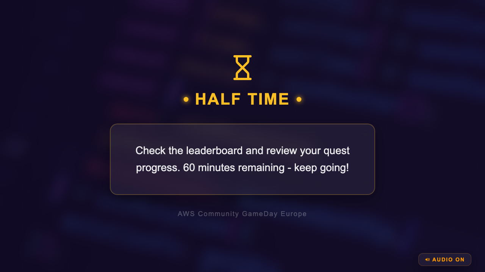 | `Insert-HalfTime` | 60-minute check-in | none |
|  | `Insert-FinalCountdown` | Last X minutes warning | `minutesRemaining` |
|  | `Insert-GameExtended` | Extra time announced | `extraMinutes` |
| 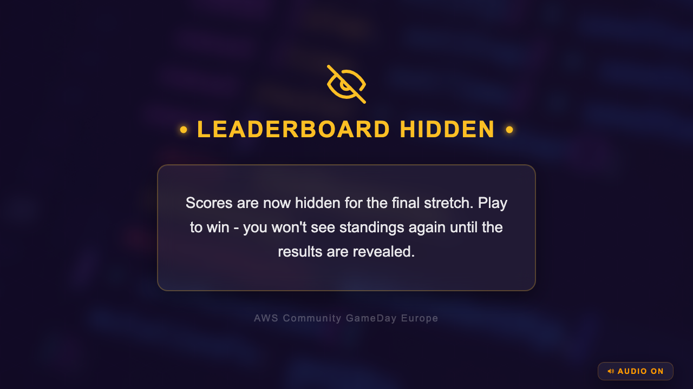 | `Insert-LeaderboardHidden` | Scores go dark for final stretch | none |
|  | `Insert-ScoresCalculating` | Waiting for final results | none |
| 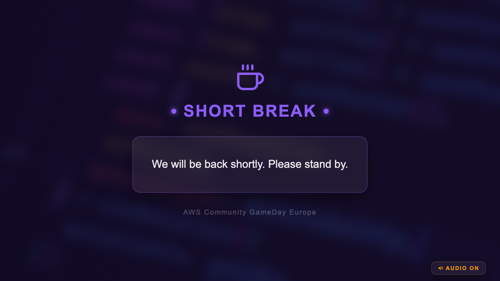 | `Insert-BreakAnnouncement` | Stream pausing | none |
|  | `Insert-WelcomeBack` | Returning from break | none |

**Color coding:** Gold for neutral milestones · Orange for AWS platform events · Violet for community/break moments

---

## Live Commentary

Narrative broadcast moments that make the stream feel like a live sports commentary rather than a status board. Build tension, celebrate achievements, and give the audience someone to follow.

| Screenshot | Insert ID | Purpose | Props to update |
|------------|-----------|---------|-----------------|
|  | `Insert-FirstCompletion` | First team to finish a quest — the "goal scored" moment | `questName`, `teamName`, `teamGroup` |
| 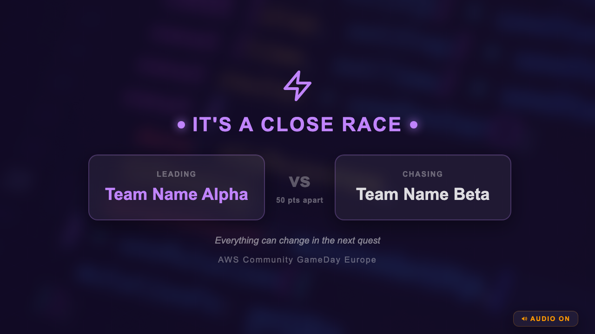 | `Insert-CloseRace` | Two teams neck and neck | `teamA`, `teamB`, `pointDiff` |
|  | `Insert-ComebackAlert` | Team climbing dramatically | `teamName`, `userGroup`, `fromRank`, `toRank` |
|  | `Insert-TopTeams` | Mid-game standings snapshot | `label`, `topTeams[]` array |
| 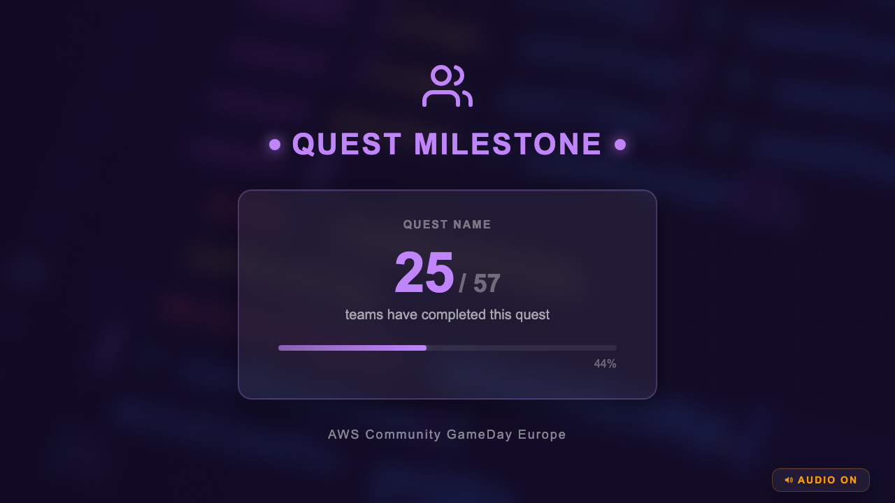 | `Insert-CollectiveMilestone` | "X of Y teams completed quest Z" | `questName`, `completedCount`, `totalCount` |
| 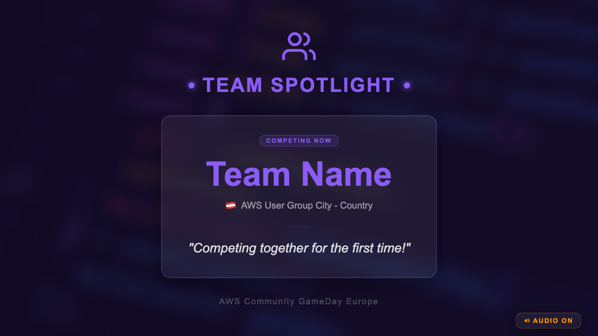 | `Insert-TeamSpotlight` | Feature a specific team — human interest | `teamName`, `userGroup`, `country`, `countryFlag`, `fact` |

**Color coding:** Accent for celebrations and drama · Violet for community moments

**Cadence:** One commentary insert every 15–20 minutes during gameplay. Space them out so each one lands.

---

## Quest Operations

Quest status changes. Use these whenever a quest breaks, gets fixed, unlocks, or needs a hint.

| Screenshot | Insert ID | Purpose | Props to update |
|------------|-----------|---------|-----------------|
| 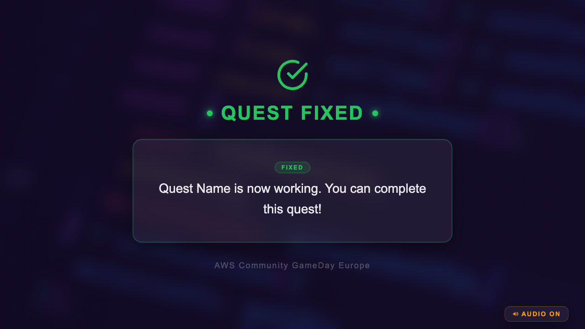 | `Insert-QuestFixed` | A broken quest has been repaired | `questName` |
| 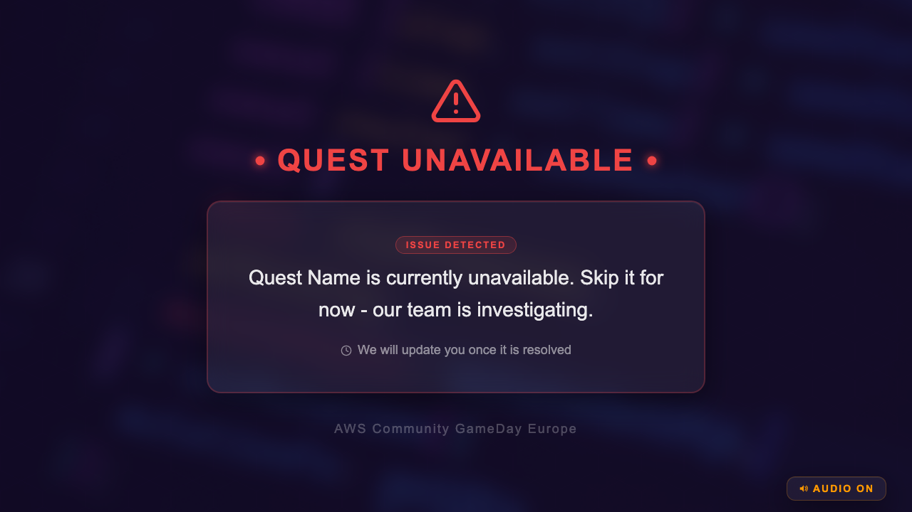 | `Insert-QuestBroken` | A quest is unavailable — teams should skip | `questName` |
| 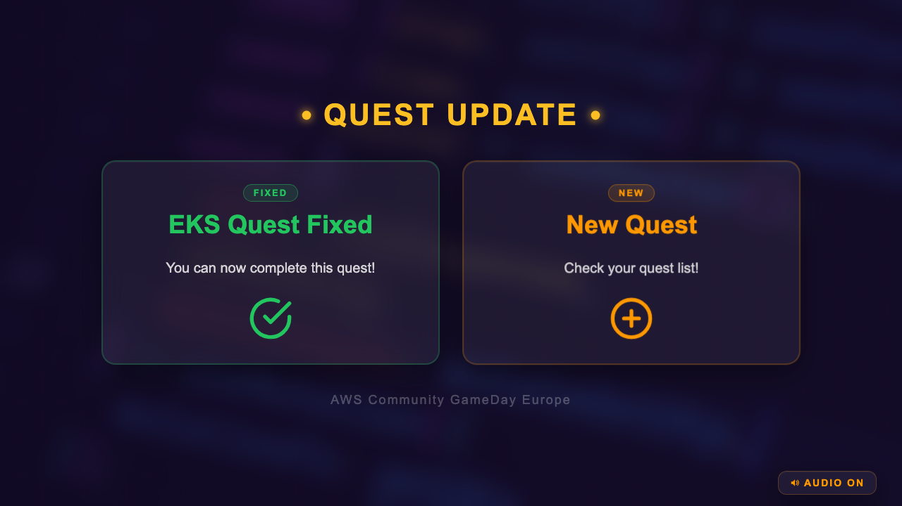 | `Insert-QuestUpdate` | Quest fixed AND new quest simultaneously — two-card layout | `fixedQuestName`, `newQuestName` |
| 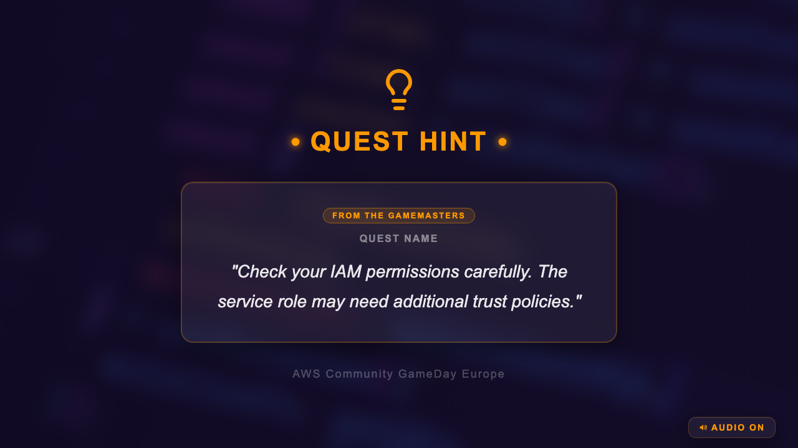 | `Insert-QuestHint` | Gamemaster hint for stuck teams | `questName`, `hintText` |
|  | `Insert-NewQuestAvailable` | Fresh quest just unlocked | `questName`, `description` |
| 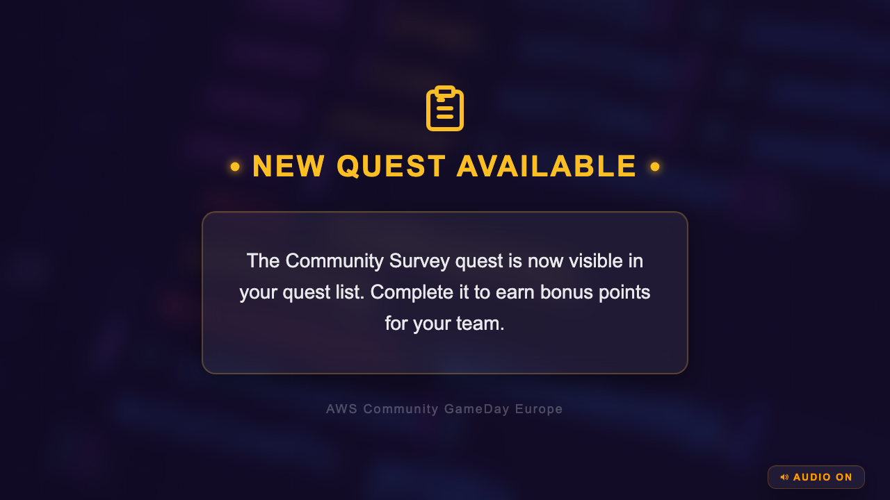 | `Insert-SurveyReminder` | Bonus survey quest is open | `questName` |

**Color coding:** Green for fixed/resolved · Red for broken · Orange for new/hints

---

## Operational

Platform status, score management, and Gamemaster announcements. Communications from the people running the event infrastructure.

| Screenshot | Insert ID | Purpose | Props to update |
|------------|-----------|---------|-----------------|
| 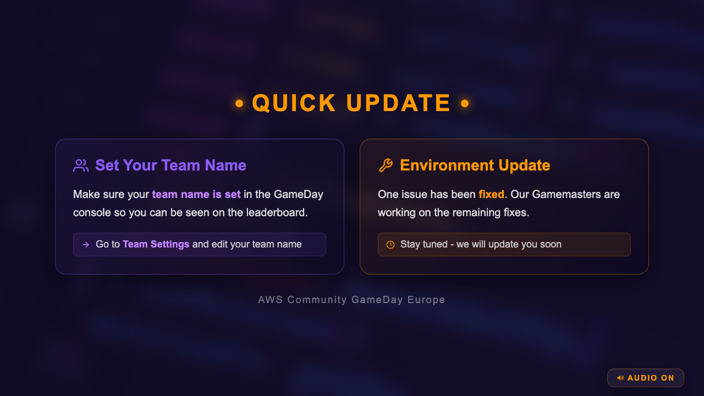 | `Insert-StreamInterruption` | Environment + community update — two-card layout | Edit cards directly |
|  | `Insert-TechnicalIssue` | Known issue under investigation | `questName`, `message` |
|  | `Insert-Leaderboard` | Leaderboard scores updated | none |
| 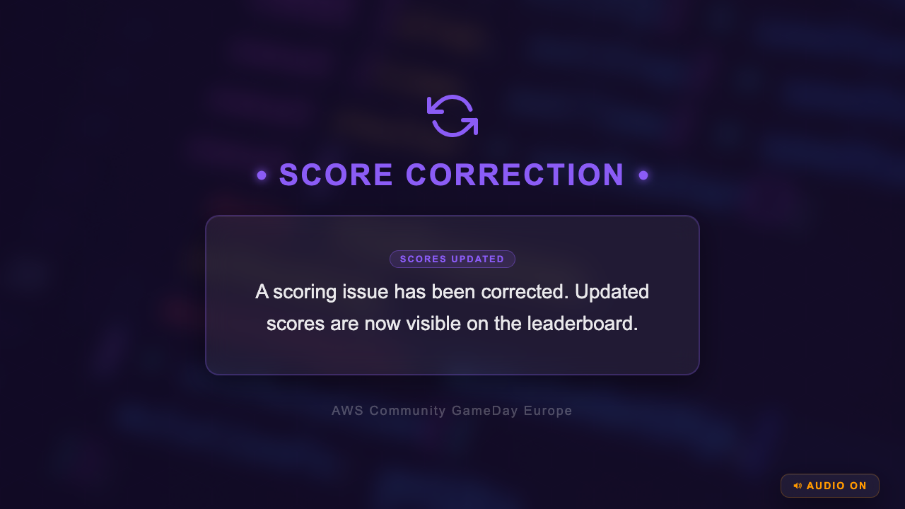 | `Insert-ScoreCorrection` | Scores manually adjusted | `reason` |
| 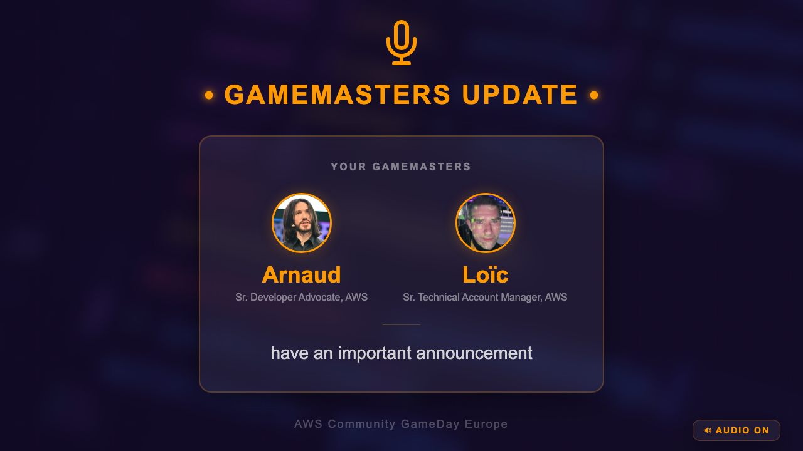 | `Insert-GamemastersUpdate` | Live announcement from Gamemasters | `message` |

**Color coding:** Orange for AWS/Gamemaster/platform · Red for technical issues · Violet for score corrections

**GamemastersUpdate:** Names and face photos come automatically from `config/participants.ts` — only update `message`.

---

## People & Community

Person-focused moments and location highlights. Keep the stream personal and connected to the community watching from their cities.

| Screenshot | Insert ID | Purpose | Props to update |
|------------|-----------|---------|-----------------|
|  | `Insert-StreamHostUpdate` | Stream host has an announcement | `streamHostName`, `message` |
|  | `Insert-LocationShoutout` | Greet a city or user group | `city`, `country`, `flag` |
|  | `Insert-ImportantReminder` | Anything that doesn't fit another category | `title`, `message` |

**Color coding:** Violet for community moments · Accent for location highlights

**StreamHostUpdate:** Face photo and role come from `config/participants.ts` — match `streamHostName` to the `name` field.

---

## Editing Props before going live

All inserts with configurable data expose their variables in Remotion Studio's **Props panel**:

1. Run `npm run studio`
2. Select an insert from the sidebar
3. Click the **Props** tab (top-right panel)
4. Type in the values — preview updates instantly

The Props panel uses Zod schemas for validation. Numbers stay numbers, arrays stay arrays. No code editing needed during a live event.

---

## Regenerating all insert screenshots

```bash
# Event flow
for frame_id in "Insert-QuestsLive:quests-live" "Insert-HalfTime:halftime" "Insert-FinalCountdown:final-countdown" \
  "Insert-GameExtended:game-extended" "Insert-LeaderboardHidden:leaderboard-hidden" \
  "Insert-ScoresCalculating:scores-calculating" "Insert-BreakAnnouncement:break-announcement" \
  "Insert-WelcomeBack:welcome-back"; do
  id="${frame_id%%:*}"; name="${frame_id##*:}"
  npx remotion still src/index.ts "$id" "screenshots/inserts/readme-insert-$name.png" --frame=60
done

# Commentary
for frame_id in "Insert-FirstCompletion:first-completion" "Insert-CloseRace:close-race:90" \
  "Insert-ComebackAlert:comeback-alert:90" "Insert-TopTeams:top-teams:120" \
  "Insert-CollectiveMilestone:collective-milestone:90" "Insert-TeamSpotlight:team-spotlight"; do
  id="${frame_id%%:*}"; name="${frame_id##*:}"
  npx remotion still src/index.ts "$id" "screenshots/inserts/readme-insert-$name.png" --frame=60
done
```
