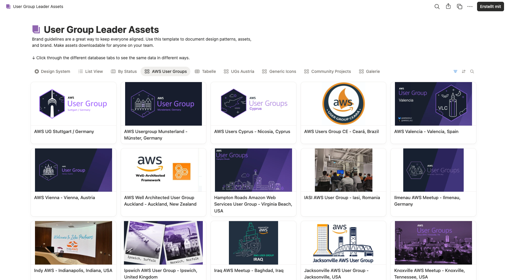

# Screenshots — Misc

Supporting screenshots that don't belong to a specific composition — external tools, configuration references, and supporting materials.

---

## Notion — User Group Logo Gallery

The 53+ user group logos used throughout the compositions are hosted in a shared Notion database maintained by the AWS Community DACH team. The logos are loaded at render time from this gallery — they are not stored in the repository.

**URL:** [awscommunitydach.notion.site — AWS User Groups Gallery](https://awscommunitydach.notion.site/89ae998ccfc941f8a4ebf3e7b6586045?v=11f535253b02470f963a6d844ca671d4)

**How it works:**
- `config/logos.ts` maps user group names to their Notion image CDN URLs
- At render time, Remotion fetches each logo via the `Img` component
- If a logo is missing or the URL is unreachable, the composition falls back to a flag-only card
- Rendering requires an internet connection

**Updating logos:**
1. Open the Notion gallery and update the image for the user group
2. Get the new CDN URL and update `config/logos.ts`
3. Re-render the compositions that show user group logos (InfoLoop, ClosingPreRendered, MarketingVideo)
