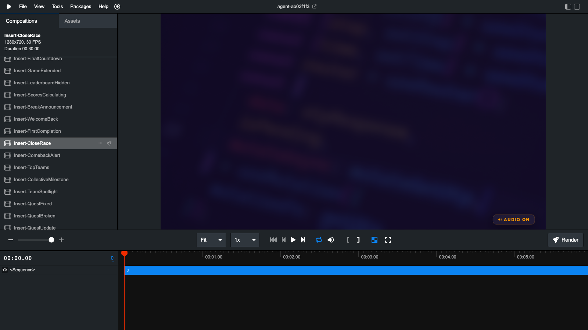
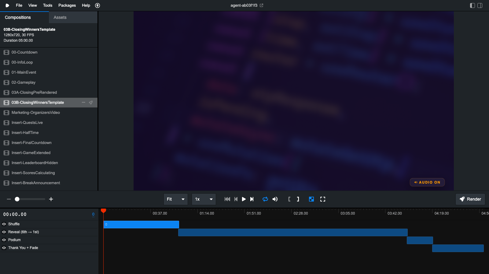
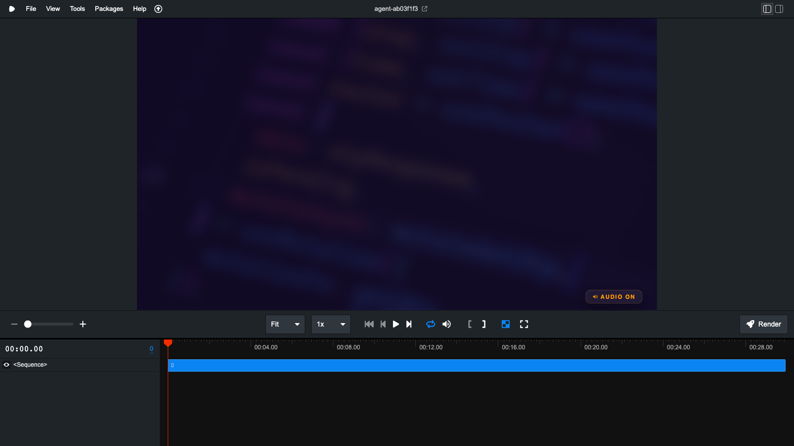

# Screenshots — Remotion Studio

Screenshots of the Remotion Studio development environment. Use these to orient new contributors who haven't used Remotion before, or as reference images in onboarding documentation.

---

## Studio overview

The main Remotion Studio interface showing the composition list and timeline.

**What you see:**
- **Left sidebar** — Compositions tab listing all 35 registered compositions. Click any to preview.
- **Center** — Live preview of the selected composition at the current frame.
- **Bottom** — Timeline. Scrub left/right to any frame. The blue bar shows the full composition duration.
- **Top-right** — Render button to export the selected composition to video or image.

**How to open:** `npm run studio` → `http://localhost:3000`

---

## Insert selected in sidebar

An insert composition (`Insert-CloseRace`) selected in the sidebar. Note the short timeline (30 seconds / 900 frames) compared to the main compositions.

All inserts start with `Insert-` in the sidebar and are grouped in the list below the main event compositions.

---

## Closing ceremony composition

The `03B-ClosingWinnersTemplate` composition selected — showing its much longer timeline (several minutes of animated winner reveals, podium, and thank-you).

---

## Props panel

The Props panel (right sidebar, **Props** tab) allows live editing of all configurable insert variables without touching code.

**How to use:**
1. Select any insert that has configurable data (e.g. `Insert-CloseRace`, `Insert-GamemastersUpdate`)
2. Click **Props** in the top-right panel
3. Edit the form fields — `teamA`, `teamB`, `pointDiff`, etc.
4. The preview updates instantly

Inserts with no configurable variables (like `Insert-HalfTime`, `Insert-QuestsLive`) show an empty Props panel — they have fixed content and nothing to update.

---

## Keyboard shortcuts

| Key | Action |
|-----|--------|
| `Space` | Play / Pause |
| `←` / `→` | Step one frame back/forward |
| `J` / `L` | Decrease / increase playback speed |
| `Home` / `End` | Jump to first / last frame |
| `I` / `O` | Set in/out points for a clip range |

---

## Rendering from Studio

Click the **Render** button (top-right) to export the current composition. You can choose format (MP4, WebM, GIF, PNG sequence), quality, and frame range.

For scripted rendering, use the CLI instead — see [docs/remotion.md](../../docs/remotion.md).
